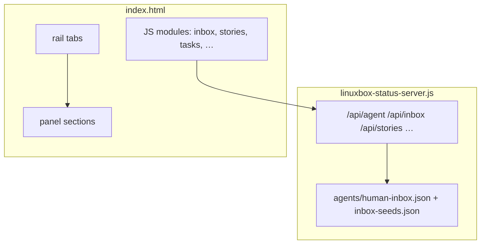

# Linuxbox dashboard UI — architecture

**Single source of truth** for how `scripts/linuxbox/linuxbox-status/index.html` is structured.  
Read this **before** any dashboard UI change. Do not add global `input {}` rules.

---

## 1. What this app is

| Layer | Responsibility |
|-------|----------------|
| **Shell** | `.app` → `.rail` (silos + secondary) + `.workspace` (panels) |
| **Silos (2026-07-26)** | System · Tasks · Ops Chat · News · Docs · Pixi RP · Mazda3 · Meta — Maps off-dashboard (`map.tableslop.org`). Plan: `docs/plans/linuxbox-silo-dashboard-2026-07-26.md`. **Meta** = lane sync / systems design; papercuts · meta-harness · backlog live at bottom of **System**. |
| **Panels** | One `<section id="{tab}">` per rail tab; only one `.active` at a time (`hub` = System, `systems` = Host detail, `garage` = Mazda3, `pixi` = Pixi RP) |
| **Data** | `linuxbox-status-server.js` REST under `/api/*`; JSON files in `agents/` |
| **Client state** | `agentData` (hub/System), `sessionStorage` (inbox drafts, tab prefs), `localStorage` (sizing, camp focus) |



---

## 2. Why bugs happened (honest postmortem)

**Process (GM):** when something is wrong → (1) understand *why* → (2) leave a prevention so it cannot silently recur. Symptom-only patches are unfinished.

**2026-08-03 Hub empty / rail-in-center layout:** `.mobile-page-select-wrap` lived as the first child of `.app`. Potato CSS hid it only inside `@media (max-width: 768px)`, so on desktop it stayed a grid item, stole the 64px rail column, pushed `.rail` into the main column, and crushed `.workspace` into a left sliver. **Prevention:** hide the wrap with `display: none` *outside* media queries; pin desktop layout with `grid-template-areas: "rail workspace"` (mobile uses `pagesel` / `workspace` / `rail`); bump `dash-build` pair; Playwright layout smoke (`railLeft≈0`, `wrapDisplay=none`).

**2026-08-08 Hub inputs “tick” / selection reset:** `load()` (~20s) + `pollThinkLive` (~2.5–5s) rebuilt Worker log / Active-now goal / Meta papercuts / debug JSON via `innerHTML`, wiping caret and highlights in Fix this, chat, Tasks goal, and the live log. **Prevention:** `hubUserIsEditing()` — while a textarea/input is focused or a text selection is active, patch Worker Goal/Step/log in place and skip destructive panel rebuilds; dash-build `db_20260808-hub-edit-preserve-r1`.

The dashboard grew as **one HTML file** with:

1. **Global element selectors** (`input { width: 100% }`) — correct for text fields, catastrophic for radios.
2. **Feature additions without a control taxonomy** — Inbox reused “form” patterns that didn’t exist; radios inherited text-field CSS.
3. **Full innerHTML re-render** on one Inbox submit — wiped drafts in sibling questions.
4. **No structural test** until late — layout breaks weren’t caught before deploy.

**Policy:** No new global rules on bare `input`, `textarea`, or `select`. Only scoped families below.

---

## 3. Form control families (the only allowed patterns)

### Family A — `.field` (labeled block)

Use for: Tasks, character registry, backlog, any **text / textarea / select** with a label above.

```html
<div class="field">
  <label for="x">Label</label>
  <input type="text" id="x" />
</div>
```

CSS targets **only** `.field input[type="text"]`, `.field textarea`, `.field select` — never `.field input` bare.

### Family B — `.inbox-choice` / `.tag-check` (choice row)

Use for: Inbox radio/checkbox, task tag checkboxes.

```html
<label class="inbox-choice">
  <input type="radio" name="…" value="…" />
  <span>Option label</span>
</label>
```

Inputs are **fixed 1rem**, never `width: 100%`. Label text lives in `<span>`.

### Family C — toolbar selects

Use for: Campaign picker, story filter, task filter, chat profile, size popover.

Parent: `.camp-pick-bar`, `.story-camp-pick`, `.task-board-toolbar`, `.chat-toolbar`, `.size-row`.

`width: auto` — not full bleed.

### Family D — `.inbox-answer` (inbox text)

Inbox free-text and “Other (specify)” only. Not used outside `#inbox-open`.

### Family E — `.btn` / `button`

Always `width: auto`. Primary actions in `.inbox-actions`, `.chat-compose`, etc.

---

## 4. Inbox module — data & state (read before touching Inbox)

### Sources

| Source | Role |
|--------|------|
| `agents/state/human-inbox.json` | Agent-posted + human **answered** history (runtime; gitignored) |
| `agents/inbox-seeds.json` | Canonical worldbuilding questions |
| Server `mergeInboxSeeds()` | Seeds appear in `open[]` until answered by `id` |

### Question types

| `type` | UI family | Answer shape |
|--------|-----------|--------------|
| `text` | D | plain string |
| `choice` | B (+ optional D for Other) | one option or `Other: …` |
| `multi` | B checkboxes | comma-separated |
| `yesno` | E buttons | `Yes` / `No` |

### Client state machine

```text
loadInbox()
  → GET /api/inbox
  → for each open question: renderInboxItem(q, drafts[q.id])
  → bindInboxItem (per card)

User edits → setInboxDraft(id, value) in sessionStorage

Submit one card:
  → POST /api/inbox/reply { id, answer }
  → on success: remove ONLY that .inbox-item from DOM
  → prepend to #inbox-answered
  → clearInboxDraft(id)
  → load() for hub badge count
  → do NOT re-render sibling cards
```

**Invariant:** Answering question A must not destroy the DOM or drafts for question B.

### Seeds vs agent questions

- Seeds are **not** written to `human-inbox.json` until answered.
- Answering a seed writes the full item (including `seeded: true` metadata) to `answered[]`.

### Question copy (required for seeds + agent posts)

Every inbox item should include:

| Field | Required | Purpose |
|-------|----------|---------|
| `question` | yes | Short headline the GM reads first |
| `context` | yes | 2–4 sentences: what this is **in-fiction** + what the agent will do with the answer. No bare PRI-#### or file paths without a one-line summary. |
| `option_help` | choice/multi | Array parallel to `options[]` — one line per option explaining play impact |
| `campaign` | when applicable | e.g. `tropic-gooner` |

**UI:** `context` renders in `.inbox-context` (cyan border) **above** options; `option_help` renders as a bullet list under context.

**Agent rule:** Never post acronyms or org IDs without explaining them in `context`. If the human answers "need more context" or "confused", post a **new** follow-up question with full context — do not treat the vague answer as a final taste decision.

---

## 5. Change checklist (required)

Before marking a dashboard UI task done:

1. [ ] Read this doc — which **family** does each new control use?
2. [ ] No new global `input` / `textarea` / `select` rules in `<style>`.
3. [ ] Multi-field panels: preserve drafts or patch DOM — no full re-render on partial submit.
4. [ ] Run `bash scripts/linuxbox/run-dashboard-ui-smoke.sh` (inbox alignment checks included).
5. [ ] `curl` :8790 → 200; restart `linuxbox-status` if server JS changed.

---

## 6. Files map

| File | Touch when |
|------|------------|
| `index.html` | Layout, CSS families, client modules |
| `linuxbox-status-server.js` | API, inbox merge/reply, auth |
| `agents/inbox-seeds.json` | New canonical GM questions (must include `context`) |
| `agents/state/human-inbox.json` | Agent ad-hoc questions only (runtime) |
| `.staging/.../dashboard-ui-smoke.mjs` | New tabs or layout invariants |
| `agents/LINUXBOX_DASHBOARD_TASK.md` | Agent lane spec |

---

## 7. Future (when pain justifies it)

- Extract CSS to `linuxbox-status/dashboard.css` and JS modules per tab.
- Split Inbox into `inbox.js` with unit-testable render/bind functions.
- Until then: **families + this doc** are the contract.
