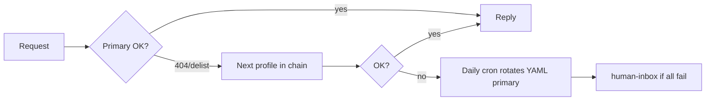

# Hermes model failover

When OpenRouter **delists** a model (HTTP 404 / "unavailable for free"), crons and chat used to hard-fail. This lane adds **detect → backup → proceed**.

## Pieces

| File | Role |
|------|------|
| `agents/hermes-model-registry.json` | Per-profile model chains + chat retry order |
| `scripts/linuxbox/hermes-model-failover.sh` | Probes OpenRouter; rotates `~/.hermes/profiles/*/config.yaml` primary |
| `agents/state/hermes-model-health.json` | Last run state |
| `reports/hermes-model-health/YYYY-MM-DD.md` | Daily report |
| Dashboard `runHermesChat()` | On model error, retries `think` → `meta` → `code` in one request |

## Flow



## On linuxbox

```bash
cd ~/agent-dump
bash scripts/linuxbox/hermes-model-failover.sh
bash scripts/linuxbox/install-hermes-model-health-cron.sh
```

After deploy, restart dashboard if server JS changed:

```bash
sudo systemctl restart linuxbox-status
```

## Manual recovery

1. `bash scripts/linuxbox/install-hermes-profiles.sh` — reset primaries from script constants.
2. `bash scripts/linuxbox/hermes-model-failover.sh` — probe and rotate to first working model in chain.
3. `hermes cron list` — remove stale crons on **default** profile without `--profile think`.

## Unified controller (planned)

Daily rollup of intent + models + feeds + smoke: **`agents/SYSTEM_INTEGRITY_TASK.md`** → `system-integrity-check.sh` (build tracked in `agents/system-integrity-progress.md`).
