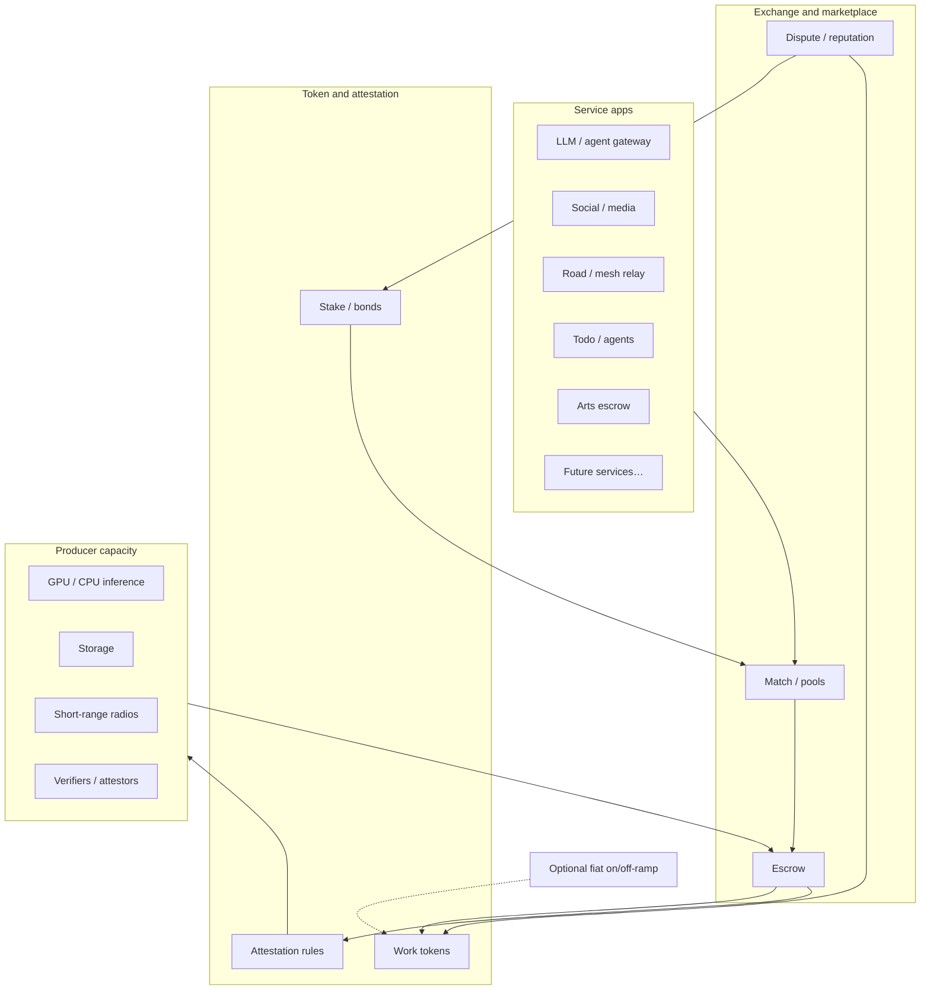

# Infranet — Formal Proposal: Compute Tokens, Exchange, and Service Layer

| Field | Value |
|-------|-------|
| **Status** | Proposal / Draft |
| **Date** | 2026-07-12 |
| **Audience** | Human review + multi-agent coordination |
| **Canonical path** | `docs/infranet-proposal.md` |
| **Project tree** | `projects/infranet/` (R&D code + earlier architecture notes) |
| **Project id** | `infranet` (see `agents/user-tasks.json`) |

This is a **design proposal**, not a claim that a live network, audited token, or production marketplace exists today. Existing demos under `projects/infranet/` are research spikes. Homelab pieces (linuxbox Hermes, free-first model routing, resource governance) are **related practice**, not the product itself.

---

## Executive summary

**Infranet** is proposed as a settlement and marketplace layer whose unit of account is **attested compute** (and related network work: storage, verification, relay). Cryptography and a shared ledger define how compute tokens are **minted, owned, escrowed, and spent**. Producers earn tokens by completing verified jobs; consumers spend tokens to buy work—especially **LLM and agent jobs**—so useful capacity can circulate **without every hop requiring cash**. Optional fiat on/off-ramps sit beside the exchange, not inside every service call.

On top of that currency, anyone can publish **user-defined paid services** (decentralized social, short-range road/awareness meshes, agent-powered todos, arts crowdfunding, and later verticals). Each service prices SKUs in the same token and fulfills via the same job/escrow pattern.

Earlier Infranet writing already covered identity, black-box verification, a compute marketplace for crypto work, and a contract platform. This proposal answers the next question: **how compute becomes a tradable currency for real services people pay for.**

---

## 1. Problem / motivation

### 1.1 What is broken today

Useful digital work—especially inference, agents, verification, and coordination—is gated by:

1. **Cash-first markets.** Spare compute (home GPU, idle boxes, edge devices) and demand for compute rarely meet without a company in the middle taking a cut and setting terms.
2. **Opaque units.** Vendor “credits,” API keys, and platform points do not transfer cleanly and rarely mean a shared, checkable claim on work done.
3. **Services stuck to platforms.** Social apps, todo tools, funding sites, and mobility data each invent their own billing. There is no shared settlement layer that says: *this payment buys this kind of work, from whoever can prove they did it.*
4. **Trust without receipts.** When someone runs a model or relays a packet for you, proving delivery and paying fairly usually means trusting a vendor dashboard—not attested evidence.

### 1.2 Why this matters here (without overselling the stack)

This workspace already struggles productively with **resource governance**: search tokens, memory, free vs paid models, and correctness (`.cursor/rules/resource-governance.mdc`). linuxbox Hermes routes **free-first** inference with paid fallbacks; OpenRouter budgets are small. That experience is evidence of the *need*—metered, accountable compute with clear economics—not proof that Infranet already exists as a network. A homelab can **prototype** settlement and LLM job metering; it is not a global marketplace.

### 1.3 What we already started (repo)

| Prior material | What it covers |
|----------------|----------------|
| [PLANNING.md](../projects/infranet/PLANNING.md) / [README.md](../projects/infranet/README.md) | Decentralized identity, black-box verification (FHE/MPC/ZKP sketch), NFC/mobile |
| [COMPUTE_REWARDS.md](../projects/infranet/COMPUTE_REWARDS.md) | Compute marketplace, resource ads, verification rewards, reputation, tokenomics for *network-internal* work |
| [BLOCKCHAIN_PLATFORM.md](../projects/infranet/BLOCKCHAIN_PLATFORM.md) | Programmable substrate (IVM / InfranetScript sketch) aimed at identity, storage, verification |
| [COST_ANALYSIS.md](../projects/infranet/COST_ANALYSIS.md) | Gas/compute-unit cost models for crypto ops (engineering cost ≠ market GPU price) |
| Python/Rust demos & tests | In-memory blockchain, identity registry, marketplace lifecycle—**placeholders**, not real FHE |
| Potato `BASELINE.md` | Source-trace of what the demo actually does (no live crypto) |

Those docs answer *how nodes earn for network work*. This proposal answers *how compute becomes a currency services settle in*—including when cash is optional.

---

## 2. Vision

In plain terms:

> You should be able to **earn** compute by offering capacity, **spend** it on LLM/agents and other services, and **build new paid apps** on the same unit—without forcing a card swipe for every like, relay, or agent run.

Long-term vision (aspirational):

- A shared **compute token** (or thin family of tokens) backed by attested work rules, not marketing.
- A **marketplace** matching consumers and producers with escrow and dispute.
- A **service layer** where LLM gateways are the first product, then an open registry of user-defined apps.
- Stronger **identity and privacy** tools (from earlier Infranet planning) available for high-trust jobs—not required for every cheap anonymous inference.

Near-term honesty: ship the smallest settlement loop that moves a balance when a real or mocked inference job completes. Expand verticals only when the settlement pattern holds.

---

## 3. Goals

### 3.1 Primary goals

| ID | Goal | Success looks like |
|----|------|--------------------|
| G1 | **Crypto-defined compute tokens** | Issuance and spend tied to attested compute / verified network work |
| G2 | **Cashless trade** | Consumer ↔ producer settle in tokens; fiat bridges optional |
| G3 | **Service layer** | Apps (esp. LLM/agent) price and settle in the same unit |
| G4 | **User-defined paid services** | Publish a service that accepts/pays tokens under clear terms |

### 3.2 Non-goals (this proposal)

- Replacing banks or “killing finance”
- Guaranteeing free unlimited LLM access
- Shipping a new L1 tomorrow
- Hard-coding only the example apps below; the architecture must stay extensible
- Treating current linuxbox/Hermes as production Infranet

### 3.3 Design principles

1. **Work backs value.** Tokens track useful attested work—not vibes.
2. **Cash is a bridge, not the product.** Daily loop is token ↔ work.
3. **Receipts over promises.** Signed job specs, attested results, dispute rules.
4. **Ponytail growth.** Smallest working settlement first; FHE/identity ambitions stay available but are not MVP blockers.
5. **Honest limits.** Hardware, latency, and model quality vary; pricing must admit that.

---

## 4. Core design: compute tokens (crypto definition)

### 4.1 Working definition

A **compute token** is a transferable claim that can be:

- **Earned** by completing attested jobs (or by protocol-approved issuance tied to staking / capacity proofs), and
- **Spent** to purchase jobs or service features that settle on the same ledger.

Product story should feel like one currency—*earn capacity, spend capacity*—even if internals later split classes.

### 4.2 What cryptography is for (plain language)

| Job | Why crypto / ledger |
|-----|---------------------|
| **Minting rules** | Who can create tokens, under what proof |
| **Ownership** | Who can spend which balance |
| **Escrow** | Lock payment until delivery conditions are met |
| **Auditability** | Settlement history without trusting one company’s database |
| **Attestation hooks** | Tie release of funds to evidence of work (signature, TEE quote, re-execution, ZK where it pays) |

Not for memecoins, yield theater, or “number go up.” If a design choice exists only for speculation, it does not belong in the core.

### 4.3 Token classes (directional)

| Class | Backing / issuance | Use |
|-------|--------------------|-----|
| **Work tokens (primary)** | Minted/unlocked on attested job completion, or escrow → producer balance | Day-to-day pay for inference, storage, relay |
| **Stake / bond** | Locked by producers (and maybe services) | Slash on fraud; matching priority |
| **Service vouchers (optional)** | Issued by a service for prepaid packages | UX sugar redeemable into work tokens or jobs |

Phase 1 can collapse to **one fungible work token** + simple stake locks. Split classes only when abuse forces it.

### 4.4 Measuring “compute” without fake precision

Do **not** pretend one universal FLOP unit prices every job fairly. Prefer:

1. **Job-class meters** — LLM: input/output tokens × model id × hardware tier; storage: GB-month; relay: packet-bytes × uptime.
2. **Posted prices** — producers name a rate; market clears.
3. **Attestation suited to the class** — signed result hash, TEE, random re-execution, ZK for identity/verification jobs from PLANNING—not ZK-for-everything.

[COMPUTE_REWARDS.md](../projects/infranet/COMPUTE_REWARDS.md) formulas remain useful for *network-internal* verification. Marketplace jobs use **escrowed consumer payment** as the main economic signal. [COST_ANALYSIS.md](../projects/infranet/COST_ANALYSIS.md) tracks engineering/gas cost of crypto ops; keep that separate from *market* prices of GPU time.

### 4.5 Fees and sinks

- Small **protocol fee** on settled jobs (verifiers, public goods, abuse response)
- Optional **burn** on spam posts or slash events
- No hidden inflation: if the protocol mints, document *why* and *caps*
- Exact percentages **TBD** (open questions); no invented APY

### 4.6 Optional cash bridges

- **On-ramp:** fiat → work tokens (regulated entity or peer OTC—policy choice)
- **Off-ramp:** work tokens → fiat
- **Default story:** earn tokens from jobs → spend on LLM / social / tools → those services pay *their* producers in tokens

Cash never needs to touch a social boost or a todo sync if both sides hold tokens.

---

## 5. Marketplace: trading without mandatory cash

### 5.1 Happy path

1. Alice runs a GPU node; stakes a bond; advertises inference capacity.
2. Bob’s agent needs summarization; his app escrows work tokens.
3. Alice runs the job; attestation passes; escrow releases to Alice.
4. Alice spends those tokens on a social feature or more agent tools—**no card swipe**.

### 5.2 Job as the atomic object

1. **Offer** — producer advertises capacity  
2. **Request** — consumer/service posts job spec (task, max price, deadline, privacy tier)  
3. **Match** — marketplace or direct pick  
4. **Escrow** — consumer tokens locked  
5. **Execute** — producer returns result + attestation  
6. **Settle** — release to producer; optional protocol/verifier fee  
7. **Dispute** — short window; rules per job class; reputation updates  

Same spirit as COMPUTE_REWARDS’ marketplace, generalized from “verification nodes” to **any attested work class**, with LLM inference as the first high-demand class.

### 5.3 Matching modes

| Mode | When |
|------|------|
| Spot market | One-off jobs; price discovery |
| Subscriptions / retainers | Locked tokens for recurring capacity |
| Pools | Many small producers behind one gateway (LLM pattern) |
| Direct peer | Known counterparties; marketplace only settles |

### 5.4 Reputation and quality

- Reputation from completed jobs and dispute outcomes (carry forward COMPUTE_REWARDS)
- Bonds that slash on proven fraud
- Service-level tags (latency, privacy, model allowlist)—filters, not one global trust theater

### 5.5 Privacy tiers (directional)

| Tier | Meaning |
|------|---------|
| Public | Metadata (maybe outputs) visible to observers |
| Encrypted transit | Payload encrypted to producer; settlement still public |
| Confidential compute | TEE / MPC / similar when the job class justifies cost |

LLM prompts usually need at least encrypted transit; full FHE for every inference is the wrong first bet.

---

## 6. Layer: LLM and other services on the token

### 6.1 First-class service: LLM / agent gateway

**Why first:** Clear unit of work, huge demand, natural fit for spare GPU, and this stack already cares about free-vs-paid routing and correctness.

**Gateway responsibilities:**

- Accept payment in work tokens (optional cash on-ramp for newcomers)
- Translate requests into **job specs** (model, context limits, max price, privacy tier)
- Route to producers (home lab, pool, remote nodes)
- Return results with attestation for the chosen tier
- Expose **human chat** and **agent/tool** APIs

**What it is not (initially):** a promise to beat every cloud provider on price, or a single global model monopoly.

**Relation to current practice (analogy, not product):** Hermes free-first → paid fallback is a *routing policy*. Infranet would turn “who gets paid for which inference” into a **settled job** with a token balance. Prototyping can meter local/OpenRouter calls against a mock ledger before any chain exists.

### 6.2 How other services plug in

Any service that defines:

1. a **SKU** (what the user buys),  
2. a **fulfillment job** (what producers do), and  
3. **acceptance rules** (when escrow releases),  

…can settle on Infranet. Token and exchange stay shared; apps stay independent.

---

## 7. Application layer: user-defined paid services

Illustrative examples—not a commitment to build all of them.

### 7.1 Decentralized social media

- **Pay tokens for:** boosted reach, private group hosting, media storage, moderation labor pools, feed-ranking model runs.
- **Earn by:** storing media, running ranking/moderation, hosting relays.
- **Cashless angle:** tips/boosts → hosting and agent mods.

### 7.2 Car / road service (short-range mesh + awareness)

- **Idea:** vehicles or roadside nodes exchange short-range messages—hazards, congestion, authenticated awareness aids for humans and assistive autonomy—*as a mesh*, not a single corporate feed.
- **Pay tokens for:** priority relay, authenticated alerts, map-layer subscriptions.
- **Earn by:** radios/edge boxes, validating/relaying packets, attested sensor summaries.
- **Hard constraints:** legal compliance by jurisdiction; anti-harassment; no facilitation of violence or evasion of lawful process; strong anti-spoofing. **High-risk vertical**—policy and safety review before any public-road prototype.
- **Architecture fit:** same job/escrow; job class ≈ “relay N authenticated packets with latency bound L.”

### 7.3 Todo / agent-powered apps

- **Pay tokens for:** recurring agent runs, private sync storage, shared household agents.
- **Earn by:** scheduled agent jobs and encrypted task-graph storage.
- **Cashless angle:** earn overnight on a GPU; spend daytime on agent help.

### 7.4 Crowdfunding arts

- Patrons **lock tokens** to a milestone; release on attested delivery (file hash, multisig accept, curator vote).
- Artists **spend tokens** on render compute, distribution storage, commission outreach.
- Cashless angle: proceeds from one piece fund the next without fiat each time.

### 7.5 More to come (extensibility)

Deliberate **service registry** pattern:

- Manifest: name, SKU schema, job-class ids, payment addresses, policy URLs
- Versioned interfaces so new verticals do not fork the token
- Experimental services on testnets / home-stack first (charter: R&D, not surprise production deploys)

---

## 8. Architecture sketch

**Actors:** consumer · producer · service operator · verifier/attestor · protocol/treasury (rules in code + governance, not a black-box company account).

**Optional cash bridges** sit *beside* the exchange—not inside every service call.

---

## 9. Trust, security, and economics

### 9.1 Anti-abuse

| Threat | Direction |
|--------|-----------|
| Fake work / garbage inference | Bonds, spot re-execution, allowlists, reputation |
| Spam job posts | Posting deposits / burns; rate limits |
| Sybil producers | Stake, identity for high-trust tiers, diversity-aware matching |
| Griefing disputes | Short windows; bond to challenge; clear evidence rules per job class |
| Speculation-first token | Tie primary issuance to jobs; no yield theater in core docs |

### 9.2 Double-spend and settlement integrity

- Single ledger (or equivalent) for balances; escrow locks before work starts
- Release conditions encoded in job acceptance rules
- No “spend the same credit twice” via vendor DB forks—settlement is the source of truth

### 9.3 Metering

- Job-class meters (not fake universal FLOPs)
- Producers post rates; consumers set max price
- Services may wrap meters (e.g. “agent run” = N inference jobs + storage)
- Homelab prototype: log OpenRouter/local inference against a mock ledger before trusting on-chain meters

### 9.4 Privacy and data

- Privacy tiers (§5.5); minimize metadata
- Prompts and location/mobility data are sensitive—default encrypted transit for LLM; mobility needs stricter review
- Earlier PLANNING black-box verification applies where credential secrecy matters; not every LLM call

### 9.5 Legal / regulatory (esp. mobility)

Road-safety and surveillance laws vary. Delay public-road pilots; jurisdiction gates; human review. Do not prototype evasion tooling.

### 9.6 Centralization risk

Large GPU farms can capture markets. Prefer matching options for local-first / diversity; pools that include small producers; honest UX that does not hide capture.

---

## 10. Phased roadmap (ponytail)

Dates are order-of-work, not promises.

### Phase 0 — Align and spike (now / homelab)

- This doc as **service-economy** north star
- Reconcile AGENT-CHARTER scope (network R&D vs agent-architecture side docs remain separate tracks unless merged)
- **Smallest settlement spike:** local producer + consumer + escrow mock (even single-process) that moves a balance when a fake or real “inference job” completes—leave one runnable check
- Optional: meter one Hermes/OpenRouter call against the mock ledger (learning only)

### Phase 1 — Work token + escrow MVP

- Fungible work token on a **chosen substrate** (Infranet chain sketch, thinner app ledger, or existing public chain—open question)
- Job spec schema for **LLM inference only**
- Escrow + settle + basic reputation store
- Cash on-ramp: manual/admin for testers only

### Phase 2 — LLM service gateway

- HTTP/API gateway priced in tokens
- Producer daemon for home GPU / lab machines
- Attestation v1 (signed results ± TEE if available)
- Feed lessons into COMPUTE_REWARDS formulas

### Phase 3 — Second service vertical

- Pick **one** of: agent-todo, arts escrow, or social storage/boost—clear owner and test users
- Prove registry/SKU pattern for a non-LLM job class

### Phase 4 — Harder verticals and stronger crypto

- Stronger identity / black-box verification where needed (PLANNING track)
- Mobility / short-range mesh only after legal/safety review
- Multi-class tokens only if Phases 1–3 show real need

### Phase 5 — Scale and governance

- Fee finalization, treasury rules, producer diversity incentives
- External audit of settlement and attestation assumptions
- Production promotion is **explicit**—per charter, not accidental

**Homelab vs long-term:** Phases 0–2 can live on PC + linuxbox without claiming a public network. Phases 3–5 are product/network scale and need deliberate promotion.

---

## 11. Open questions

1. **Substrate:** custom chain (BLOCKCHAIN_PLATFORM) vs public chain vs thin application ledger for MVP?
2. **One token or many** at Phase 1?
3. **Attestation minimum** for paid LLM jobs (signature only vs TEE vs redundant execution)?
4. **Who runs cash on/off-ramps**, and where?
5. **Governance:** who changes fees and job-class rules?
6. **Default privacy** for prompts and for location/mobility data?
7. **UX naming:** “compute credits” vs on-chain jargon for end users?
8. **Scope merge:** does this proposal supersede identity-first README marketing, or stay a parallel track?
9. **First spike owner:** PC lab vs potato always-on vs both?

---

## 12. What to review next (for humans)

Please mark:

- [ ] Core idea (compute as tradable attested work) — agree / revise
- [ ] Cashless consumer ↔ producer loop — agree / revise
- [ ] LLM gateway as first service — agree / revise
- [ ] Example verticals (social, mobility, todos, arts) — keep / drop / re-prioritize
- [ ] Phase 0–1 spike shape — agree / propose different smallest slice

Feedback: `AI_GROUPCHAT.md` ledger lines, or tasks under project id `infranet` in `agents/user-tasks.json`.

---

## Appendix A — Sources / prior notes found

### A.1 PC workspace (`agent-dump`)

| Path | Notes |
|------|-------|
| `projects/infranet/README.md` | Overview: identity + storage + black-box verification |
| `projects/infranet/PLANNING.md` | Full architecture sketch (FHE/MPC/ZKP, PoID+PoS, phases) |
| `projects/infranet/COMPUTE_REWARDS.md` | **Closest ancestor** to this proposal: marketplace, rewards, reputation, tokenomics |
| `projects/infranet/BLOCKCHAIN_PLATFORM.md` | IVM / InfranetScript / utility-oriented contracts |
| `projects/infranet/COST_ANALYSIS.md` | Gas and marketplace pricing models for demos |
| `projects/infranet/RESEARCH.md` | Identity/biometric/PoID research notes |
| `projects/infranet/DEMO.md`, `demo.py`, `tests/` | Runnable in-memory demos (placeholders for real crypto) |
| `projects/infranet/AGENT-CHARTER.md` | R&D umbrella; promote to `docs/` after sign-off |
| `projects/infranet/claude-code-plan-kill-1.md`, `five-levels-ai-agents-deepwing.md` | **Separate track** (agent-architecture study)—not the network economy |
| `agents/user-tasks.json` | Project `infranet` + open reconcile/spike/baseline tasks |
| Desktop sibling `MAIN_PROGRAMMING_FILES/Infranet/` | Source tree transferred into `projects/infranet/` (2026-06-28 ledger); same doc family |
| `.cursor/skills/rewind/SKILL.md` | Points resume context at Infranet paths |

### A.2 Potato (SSH `potato`)

| Path | Notes |
|------|-------|
| `~/agent-dump/projects/infranet/*` | Same core docs as PC (README, PLANNING, COMPUTE_REWARDS, BLOCKCHAIN_PLATFORM, COST_ANALYSIS, …) |
| `~/agent-dump/projects/infranet/BASELINE.md` | **Potato-only relative to PC tree at search time:** source-code baseline of demo behavior (execution was blocked that tick; document is a read-only trace). Confirms FHE/MPC/ZKP are type labels in Python, not implementations. |
| `/media/abhinav/PERSONAL/.../ponytail-board.md` | Mentions Infranet only in a CRLF cleanup card for `rewind.html`—not product design |
| `/mnt/archive` | No additional Infranet design markdown found in a keyword search this pass |

### A.3 Laptop / USB kit

- Searched laptop-usb-kit materials under the PC repo and attempted `E:\` (not mounted this session).
- **No Infranet / compute-token notes found** in USB kit docs or ledger lines tagged as laptop-authored product design.
- Do not invent laptop content; if a laptop clone has private notes, pull/merge later and cite then.

### A.4 What was *not* found

- No prior formal “compute token as service currency + user-defined apps” proposal in `docs/` before this file.
- No laptop-authored Infranet product brief in searchable USB/kit paths this session.
- Live demos do **not** implement real FHE/MPC/ZKP or a production token (per potato BASELINE + code structure).

### A.5 Relation of this doc to older writing

This proposal **complements** COMPUTE_REWARDS / PLANNING / BLOCKCHAIN_PLATFORM. It does **not** delete them. It reframes the north star around **compute-as-currency + services**, with identity/crypto stacks as optional strength for higher-trust jobs.

---

## Appendix B — Document control

| Field | Value |
|-------|-------|
| Title | Infranet — Formal Proposal: Compute Tokens, Exchange, and Service Layer |
| Path | `docs/infranet-proposal.md` |
| Project mirror pointer | `projects/infranet/PROPOSAL.md` |
| Supersedes | Nothing (complements prior project docs) |
| Implementation status | **Proposal only** |
