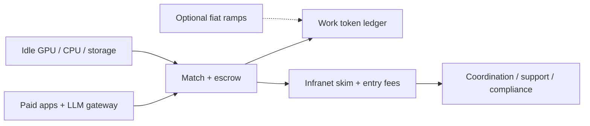

# Infranet — Formal Business Brief

**Feasibility, design summary, and phased rollout for business review**

| Field | Value |
|-------|-------|
| **Document type** | Formal business brief (founder / analyst evaluation) |
| **Status** | Draft for human review — **not a live product or fundraising deck** |
| **Date** | 2026-07-12 |
| **Primary path** | `docs/infranet/INFRANET-BUSINESS-BRIEF.md` |
| **Technical companion** | [`INFRANET-DESIGN-PROPOSAL.md`](INFRANET-DESIGN-PROPOSAL.md) (architecture depth) |
| **R&D tree** | `projects/infranet/` |
| **Audience** | Founder, advisors, partners evaluating *whether to invest time* |

**How to read**

| Label | Meaning |
|-------|---------|
| **Assumption** | Stated explicitly; change it and the conclusion may move |
| **Estimate** | Order-of-magnitude only; not audited market research |
| **Proposed** | Design / policy choice for review |
| **Demo-only** | From `COST_ANALYSIS.md` / in-repo spikes — not market GPU prices |

**Document map**

| Part | Contents |
|------|----------|
| **A** | How Infranet works (end-to-end for a business reader) |
| **B** | Market opportunity & competitive landscape |
| **C** | Value proposition & unit economics |
| **D** | Risks & mitigations |
| **E** | Go-to-market & phased rollout |
| **F** | Where it can be a fundamental platform |
| **G** | Recommendation |

---

## Verdict (read this first)

**Recommendation: Proceed-with-conditions** on founder time and R&D — **not** yet on external capital or a public network launch.

Infranet’s core thesis is sound as a *platform economics* story: monetize **coordination** (match, escrow, settlement, support) while **capacity stays on other people’s idle machines**, and grow by recruiting supply rather than buying a GPU fleet. That is a real structural advantage versus cloud CAPEX — *if* attestation, quality, and cold-start demand can be solved for at least one narrow job class (LLM inference is the strongest first bet).

It is **not** yet investable as a scaled marketplace: demos are placeholders, idle-hardware quality is uneven, regulation around tokens/on-ramps is non-trivial, and chicken-egg supply/demand will dominate the first 12–24 months. Conditions to continue are listed in Part G.

---

## Part A — How Infranet works

### A.1 One-sentence pitch

**Infranet** is a settlement and marketplace layer where the unit of account is **attested compute**: producers earn by running verified jobs on hardware they already own; consumers and apps spend those claims to buy work; the company takes a **thin platform skim** for coordination infrastructure — not for owning the machines.

### A.2 Business model in four moves

```text
1. SUPPLY     People (and labs) contribute unused/underused CPU/GPU/storage
              overnight or off-peak → producers earn compute tokens.

2. DEMAND     Users and apps buy work (esp. LLM/agent jobs) priced in tokens.
              Newcomers may buy tokens with cash (on-ramp); daily loop can stay
              token ↔ work without a card swipe each call.

3. APPS       Independent services (social, tools, funding, meshes…) pay a
              modest entry fee to list on the registry, then settle SKUs in tokens.

4. PLATFORM   Infranet Corp / founder operates coordination: matching, escrow,
              dispute, identity hooks, support, optional regulated on/off-ramps —
              funded by a small % of settled volume + app entry fees.
```

**Assumption (founder economics):** platform take rate is on the order of a **small fraction of a percent to low single-digit tenths of a percent** of *settled job volume* (illustrative working band: **0.05%–0.5%**), not 15–30% marketplace cuts. Exact rate is **Proposed / TBD**; the point is *infrastructure skim*, not extractive rent on compute.

**Assumption (CAPEX):** the company does **not** buy a large hardware fleet. Scaling = more idle capacity online + better matching — company spend is software, ops, compliance, and thin always-on coordination (which can itself start on a homelab).

### A.3 Actors

| Actor | What they do | How they pay / earn |
|-------|----------------|---------------------|
| **Producer** | Offers idle GPU/CPU/storage; runs jobs; posts attestation | Earns work tokens (minus slash risk on fraud) |
| **Consumer** | Buys inference, storage, agent runs, app features | Spends tokens (or cash → tokens once) |
| **App builder** | Publishes a paid service (SKU + fulfillment + acceptance rules) | Pays **entry fee**; settles in tokens; may take their own app margin |
| **Platform (Infranet)** | Match, escrow, dispute, registry, support, optional ramps | Skim on volume + entry fees + (later) premium support tiers |
| **Verifier** (optional) | Spot-checks / re-executes / attest rules | Small share of fees or protocol rewards |

### A.4 Atomic transaction (happy path)

1. Producer stakes a bond and advertises capacity (model tier, latency, privacy).
2. Consumer or app **escrows** work tokens against a job spec.
3. Producer executes; returns result + attestation appropriate to the job class.
4. Escrow **releases** to producer; platform skim and optional verifier fee peel off.
5. Producer spends tokens on other apps / more agent tools — **cash optional**.

Same pattern for every vertical: social boost, arts milestone unlock, mesh relay, todo agent — only the **job class** and **acceptance rules** change.

### A.5 What the “token” is (and is not)

| It is | It is not |
|-------|-----------|
| A ledger claim usable to buy attested work | A memecoin or “number go up” product |
| Earned primarily by doing (or escrowing for) real jobs | A promise of free unlimited LLM access |
| Bridged to cash at the edge when users need it | Mandatory cash on every micro-action |

**Proposed MVP:** one fungible **work token** + simple producer stake. Split token classes only when abuse forces it. Technical mint/burn detail: design proposal Pillar 1 and `COMPUTE_REWARDS.md` (historical sketch — 40/30/15/10/5 network-internal split is **not** locked for the service marketplace).

### A.6 Cash on/off-ramps (when money enters)

| Moment | Cash? | Notes |
|--------|-------|-------|
| User buys tokens to start | Optional on-ramp | Regulated entity or manual OTC in early phases |
| Producer cashes out earnings | Optional off-ramp | Same policy choice; KYC where required |
| App pays entry fee | Yes (or prepaid tokens) | Primary early corporate revenue that is *not* volume-dependent |
| Day-to-day job settle | No | Token escrow → release |
| Platform skim | Accrues in tokens; convert as needed | Ops budget |

**Proposed default story:** earn overnight on idle GPU → spend daytime on LLM/agents/apps → cash only when someone wants fiat.

### A.7 Technical skim (for reviewers who want one diagram)



Deep architecture, trust tiers, and open questions: [`INFRANET-DESIGN-PROPOSAL.md`](INFRANET-DESIGN-PROPOSAL.md).

### A.8 Relation to existing R&D (honesty)

| Asset | Role |
|-------|------|
| `projects/infranet/` demos | Research spikes / in-memory placeholders — **not** a live network |
| `COMPUTE_REWARDS.md` | Ancestor for marketplace + reputation ideas |
| `COST_ANALYSIS.md` | **Demo-only** gas/token arithmetic (e.g. assumes 1 token ≈ $0.01) — useful for engineering cost shape, **not** GPU market pricing |
| Homelab Hermes / free-first routing | Evidence of *need* for metered compute — **not** the product |

---

## Part B — Market opportunity & competitive landscape

### B.1 Problem the market already feels

1. **Spare capacity is wasted** — consumer/prosumer GPUs idle nights and weekends.
2. **Demand for inference is surging** — LLM/agent jobs are cash-gated via cloud vendors and API aggregators.
3. **Billing is opaque and non-portable** — credits, keys, and points do not transfer across apps.
4. **Building a paid app** means reinventing payment + infra every time.

Infranet attacks (3)+(4) with shared settlement, and (1)+(2) by matching idle supply to inference demand without company-owned fleets.

### B.2 Market framing (honest ranges)

**Assumption:** figures below are **order-of-magnitude framing**, not a commissioned TAM study. Treat as planning bands for founder judgment.

| Layer | Scope | Estimate band | Notes |
|-------|--------|---------------|-------|
| **TAM (loose)** | Global cloud + GPU rental + decentralized compute + LLM API spend | **High tens of billions USD/year** and growing with AI inference | Too wide to “own”; sets ceiling only |
| **SAM** | Spot / flexible GPU inference + peer compute marketplaces + indie LLM gateway spend | **Low–mid single-digit billions USD/year** (**Estimate**) | Overlaps Render/Akash/Golem/cloud spot and OpenRouter-like gateways |
| **SOM (5-year, conditional)** | Niche: attested idle-GPU inference + a handful of token-settled apps in communities Infranet can actually reach | **$1M–$30M/year GMV** settled, with platform revenue = skim + entry fees → likely **well under $1M** early unless adoption surprises | Cold-start capped; not a Series-A fantasy number |

**Assumption:** SOM assumes successful Phase 0–2 (homelab → friends → one niche gateway) and **does not** assume winning against AWS/GCP on enterprise SLA.

### B.3 Competitive landscape

| Player / pattern | What they optimize | Overlap with Infranet | Differentiation to claim |
|------------------|--------------------|------------------------|---------------------------|
| **Hyperscale cloud GPU** (AWS/GCP/Azure) | CapEx fleets, enterprise SLA | Compete on reliable inference | Infranet: no fleet CAPEX; cashless micro-settlement across apps |
| **GPU rental / render nets** (e.g. Render, similar) | Artists & batch GPU jobs | Supply-side idle GPUs | Infranet: general **job escrow + multi-app currency**, not only render |
| **Decentralized compute** (Akash, Golem, peers) | Container/VM compute markets | Closest cousins | Infranet: **service registry + user-defined paid apps** settling in the same unit; LLM gateway as first product story |
| **Storage / data markets** (Filecoin & compute-adjacent) | Storage proofs, retrieval | Adjacent capacity | Infranet may price storage as a job class later; not the first wedge |
| **LLM gateways** (OpenRouter-style) | Model routing, API UX, paid keys | Demand-side UX | Infranet: settlement in **portable compute claims**; producers can be homes, not only vendors |
| **Points / credits inside SaaS** | Lock-in billing | Psychological competitor | Portability + open app registry |

**Positioning statement (Proposed):** Infranet is not “cheaper AWS.” It is a **thin settlement OS for attested work**, with idle hardware as the supply engine and paid apps as the demand engine.

### B.4 Why “fundamental platform” is plausible (and where it is not)

**Plausible if:** many independent apps need the *same* escrowed compute currency, so network effects compound on settlement + supply.

**Not plausible if:** the only product that ever works is a single LLM gateway — then Infranet collapses into “another OpenRouter with worse SLAs,” and the platform thesis fails.

---

## Part C — Value proposition & unit economics

### C.1 Value by stakeholder

| Stakeholder | Value |
|-------------|--------|
| **Producers** | Monetize machines already bought; overnight earnings; spend earnings in-ecosystem without cashing out |
| **Consumers** | Potentially cheaper/flexible inference; portable balance across apps; cash optional after on-ramp |
| **App builders** | Skip reinventing wallets/escrow; paid entry keeps spam down; SKUs in one currency |
| **Platform** | Asset-light growth; revenue from skim + entry fees; alignment with volume rather than owning GPUs |

### C.2 Unit economics (working model)

**Labels:** all rates below are **Proposed** starting points for debate, not locked policy.

#### Token ↔ compute

- Do **not** price everything in fake universal FLOPs.
- Prefer **job-class meters**: e.g. LLM = (input + output tokens) × model id × hardware tier; storage = GB-month; relay = bytes × uptime.
- Producers **post rates**; consumers set **max price**; market clears.
- `COST_ANALYSIS.md` demo (1 token = $0.01, marketplace tasks in the $0.10–$1 range for crypto ops) is **Demo-only** for *protocol op* cost shape — separate from market GPU-hour prices (often dollars per hour on cloud for serious GPUs; idle home GPUs may clear lower with worse reliability).

#### Platform fee

| Parameter | Working band | Rationale |
|-----------|--------------|-----------|
| Skim on settled job volume | **0.05%–0.5%** (**Proposed**) | “Fraction of a percent” infrastructure cut; stay below painful marketplace rents |
| Verifier / dispute share | Split from skim or tiny add-on | Pay for integrity without bloating consumer price |
| Historical network-internal split | 40/30/15/10/5 in `COMPUTE_REWARDS.md` | **Sketch only** — applies to protocol bootstrap rewards, not corporate P&L |

**Illustrative math (Assumption):**  
If annual settled GMV = $10M and skim = 0.2%, platform take ≈ **$20k/year** — too thin alone. Therefore early viability **depends on app entry fees + services**, not skim. Skim becomes meaningful only at much larger GMV (**Assumption:** $500M+ GMV × 0.2% ≈ $1M — far beyond SOM without a breakout).

**Implication:** treat skim as **alignment + long-term upside**, and treat **entry fees + optional premium coordination** as **near-term oxygen**.

#### Application entry fees

| Parameter | Working band | Rationale |
|-----------|--------------|-----------|
| App registry entry | **Paid, not free-subsidized** — relatively cheap (**Example:** $50–$500 one-time or annual, or token-equivalent) | Filters spam; signals seriousness; early cash |
| Per-SKU listing (optional) | Small add-on | Only if registry abuse appears |
| Consumer apps’ own margins | App’s business | Infranet does not take app retail margin beyond skim on underlying jobs |

#### When cash enters (summary)

1. App entry fee → corporate treasury (cash or prepaid tokens).  
2. Consumer on-ramp → tokens minted/allocated under policy.  
3. Producer off-ramp → tokens → fiat (compliance-gated).  
4. Volume skim → mostly tokens initially; convert for ops.

### C.3 Cost structure (company)

| Cost | Nature |
|------|--------|
| Software (ledger, gateway, producer daemon, registry) | Primary build cost |
| Always-on coordination hosts | Small vs GPU fleets; can start on existing linuxbox/PC |
| Support, dispute ops | Scales with users |
| Compliance / legal (esp. ramps, mobility verticals) | Spiky; do not defer forever |
| Marketing | Needed for cold start; avoid burning cash on free app subsidies |

**Non-cost (by design):** owning and refreshing a large GPU fleet.

### C.4 Sensitivity

| If this is wrong… | Then… |
|-------------------|--------|
| Idle GPUs cannot meet quality/SLA | Gateway must blend pools + cloud fallback → margin compresses; thesis weakens |
| Users refuse any token UX | Product becomes “credits” UI over ledger — still OK if settlement stays portable |
| Skim stays tiny and apps refuse entry fees | No business — park or become pure open-source protocol |
| Only LLM gateway works | Narrow company, not platform — still may be worth a focused product, rename ambition |

---

## Part D — Risks & mitigations

| Risk | Why it matters | Mitigation direction |
|------|----------------|----------------------|
| **Cold start / chicken-egg** | No producers → no cheap jobs; no jobs → no producers | Start closed: friends’ GPUs + one paid demand source (self + niche community); paid app entry only after gateway works |
| **Quality of idle hardware** | Thermal throttling, flaky uptime, consumer GPUs, malware risk | Tiers, bonds, reputation, allowlists, spot re-execution; honest UX (not “enterprise SLA”) |
| **Fraud / fake work** | Garbage inference, result swapping | Escrow + attestation ladder (signature → TEE → redundant exec); slash stakes |
| **Trust & privacy** | Prompts and data on strangers’ PCs | Privacy tiers; encrypted transit default for LLM; confidential compute only when priced in |
| **Regulation** | Token as security?, money transmission on ramps, export, consumer protection | Delay public ramps; jurisdiction gates; legal review before public token sales; no evasion tooling |
| **Centralization of supply** | Farms capture matching | Diversity-aware matching; small-producer pools; transparent capture metrics |
| **Speculation capture** | Token trades detach from work | Issuance tied to jobs/escrow; no yield theater in core product |
| **Road/mobility vertical** | Legal/safety landmine | Explicitly late; policy review before any public-road pilot |
| **Founder bandwidth** | Competing with live stack (linuxbox, portfolio, campaigns) | Phase gates; one spike owner; R&D charter — no accidental production |

Carry forward abuse list from `COMPUTE_REWARDS.md` §8 (Sybil, collusion, free-riding, result manipulation, resource inflation).

---

## Part E — Go-to-market & phased rollout

Dates are **order of work**, not calendar promises.

### E.1 Phase 0 — Homelab truth (now)

| Goal | Verify |
|------|--------|
| Smallest settlement loop: escrow → mock/real job → balance moves | One runnable check in `projects/infranet/` |
| Optional: meter one local/OpenRouter call against mock ledger | Learning only — not product |
| This brief + design proposal aligned | Human marks review checkboxes |

**GTM:** none public. Audience = founder + agents.

### E.2 Phase 1 — Friends & family supply

| Goal | Verify |
|------|--------|
| Work token + escrow on chosen substrate (thin ledger OK) | 3–10 producer nodes (home GPUs) |
| Manual cash on-ramp for testers | Spreadsheet/ops OK |
| LLM job class only | Jobs complete with signed results |

**GTM:** invite-only Discord/Tailscale; no app store fantasy.

### E.3 Phase 2 — Niche LLM gateway

| Goal | Verify |
|------|--------|
| HTTP gateway priced in tokens | External test users finish real chats/agent loops |
| Producer daemon installable | Non-founder can run it |
| Attestation v1 | Document failure/refund rules |

**GTM:** one niche (e.g. agent builders who already hate opaque credits; or internal stack dogfood). Compete on **portable settlement + idle supply story**, not on beating GPT-4o latency.

### E.4 Phase 3 — First non-LLM app + paid entry

| Goal | Verify |
|------|--------|
| Pick **one**: agent-todo, arts escrow, or social storage/boost | Registry/SKU pattern works |
| Charge **entry fee** for listing | Cash or prepaid tokens received |
| Prove cashless loop: earn GPU overnight → spend on second app | At least one real user path |

**GTM:** builders who want paid features without Stripe-per-micro-action. Keep mobility out.

### E.5 Phase 4 — Harder verticals / stronger crypto

Identity/black-box verification (from earlier PLANNING) where trust pays; multi-class tokens only if needed; mobility only after legal review.

### E.6 Phase 5 — Scale & governance

Fee finalization, treasury rules, external audit of settlement assumptions, explicit production promotion per `AGENT-CHARTER.md`.

### E.7 Rollout diagram

```text
Homelab spike → Friends’ GPUs → Niche LLM gateway → Paid app #2 → Public cautious open
     ↑_______________ supply side growth (idle capacity) _______________|
```

---

## Part F — Where Infranet can be a fundamental platform

### F.1 Vertical candidates (priority)

| Priority | Vertical | Why / why not |
|----------|----------|---------------|
| **P0** | LLM / agent gateway | Clear meter, huge demand, fits idle GPU, dogfoodable on this stack |
| **P1** | Agent-powered todos / household tools | Natural “earn night / spend day”; lower regulatory heat |
| **P1** | Arts crowdfunding + render | Escrow milestones + GPU render; overlaps Render but settlement-shared |
| **P2** | Decentralized social (boosts, media store, mod labor) | Network effects if settlement sticks; moderation/abuse hard |
| **P3** | Encrypted storage / verification labor | Complements identity track; slower consumer story |
| **Defer** | Road / short-range awareness mesh | High legal/safety risk — architecture-compatible, product-late |

### F.2 Platform test

Infranet is a **platform** when a third-party app can:

1. Pay entry fee,  
2. Define SKUs + job classes,  
3. Settle without forking the token,  
4. Rely on shared producers for fulfillment.

Until (4) is true for ≥2 apps, call it a **product with platform ambition**.

---

## Part G — Recommendation

### G.1 Decision

| Option | Meaning | Choice |
|--------|---------|--------|
| **Proceed** | Full public build / raise now | No |
| **Proceed-with-conditions** | Continue R&D and Phase 0–2 under gates | **Yes** |
| **Park** | Stop until market/timing changes | No (not yet) |

### G.2 Conditions to keep going

1. **Ship Phase 0 settlement spike** with one runnable check (balance moves on job complete).  
2. **Pick substrate** for Phase 1 (thin app ledger vs public chain) — decide explicitly; do not boil the ocean on IVM first.  
3. **LLM-only** until escrow+attestation hold under friend-group load.  
4. **No public token sale / open on-ramp** until legal review.  
5. **Paid app entry** only after gateway has real external usage — do not subsidize a ghost registry.  
6. **Time-box founder hours** against higher-priority live stack work; Infranet stays charter R&D until promoted.  
7. Revisit go/no-go after Phase 2 with metrics: jobs settled, producer uptime distribution, dispute rate, willingness to pay entry fee.

### G.3 Would you invest time?

**Yes — bounded time.** The economics story (idle supply + thin coordination skim + paid apps on shared settlement) is a coherent platform bet and matches how this stack already thinks about metered compute. It is worth a **ponytail R&D track** through Phase 0–1 and a harsh Phase 2 review.

**Not yet — unbounded time or capital.** Without quality attestation and a real demand wedge, this becomes another underused decentralized compute paper. Do not staff it like a startup until Phase 2 metrics exist.

### G.4 Review checklist (human)

- [ ] Business model (idle supply + skim + entry fees) — agree / revise rates  
- [ ] SOM honesty / competitive framing — agree / revise  
- [ ] LLM gateway as first wedge — agree / change  
- [ ] Proceed-with-conditions — accept / park / proceed harder  
- [ ] Phase 0 spike owner (PC vs potato vs both)

Feedback: `AI_GROUPCHAT.md` ledger lines, or project `infranet` in `agents/user-tasks.json`.

---

## Appendix A — Source map

| Path | Use in this brief |
|------|-------------------|
| `docs/infranet/INFRANET-DESIGN-PROPOSAL.md` | Technical design depth |
| `projects/infranet/COMPUTE_REWARDS.md` | Marketplace, reputation, historical token split |
| `projects/infranet/COST_ANALYSIS.md` | Demo gas/token cost shapes (**Demo-only**) |
| `projects/infranet/PLANNING.md` | Identity / FHE-MPC-ZKP ambition (optional strength) |
| `projects/infranet/BLOCKCHAIN_PLATFORM.md` | Substrate sketch (open question) |
| `projects/infranet/AGENT-CHARTER.md` | R&D vs production promotion |
| `docs/infranet-proposal.md`, `projects/infranet/PROPOSAL.md` | Stubs → this brief + design proposal |

## Appendix B — COST_ANALYSIS caveat (explicit)

`COST_ANALYSIS.md` examples (identity registration ≈ $0.02, simple transfer ≈ $0.21, FHE task rewards ≈ $0.10–$1.00 under **1 token = $0.01**) describe **demo ledger economics**, not:

- market price of an NVIDIA GPU-hour,  
- OpenRouter token prices, or  
- Infranet Corp revenue forecasts.

Use them to sanity-check that **protocol operations can be cheap relative to useful work** if the substrate cooperates — then price marketplace jobs from **posted producer rates**.

---

## Document control

| Field | Value |
|-------|-------|
| Title | Infranet — Formal Business Brief |
| Canonical path | `docs/infranet/INFRANET-BUSINESS-BRIEF.md` |
| Complements | `INFRANET-DESIGN-PROPOSAL.md` |
| Implementation status | **Brief only — no code** |
| Recommendation | **Proceed-with-conditions** |
