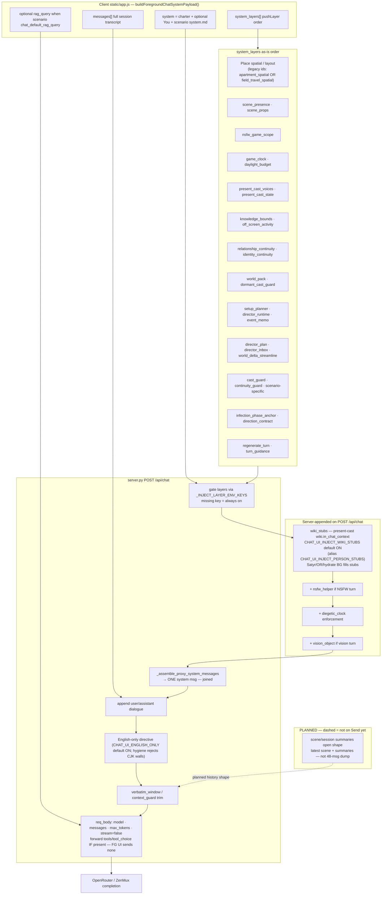

# Pixi RP — What OpenRouter receives on Send

**SoT verified:** linuxbox `~/pixi-rp/ObsidianWriterStack/PixiApp/chat-ui` (SSH `potato`, 2026-07-21).  
**Plan cross-ref:** `pixi-rp-context-agency-plan.md` §1 (inject map) + §2 (to-be).  
**FG model (live env):** `CHAT_UI_FG_OPENROUTER_MODEL=openrouter/poolside/laguna-xs-2.1:free` (`~/.linuxbox-pixi/deckard-local.env`).

**Legend**

| Style | Meaning |
|-------|---------|
| Solid boxes / normal table rows | **As-is today on potato** — verified in `static/app.js` + `server.py` Send path |
| Dashed / *italic* | **Planned** — builders/BG jobs may exist; **not** live-injected on FG Send |

---

## 1. Mermaid — OpenRouter request composition



### Assembly rule (as-is)

1. Client builds `system` + ordered `system_layers[]` + `messages[]` (+ optional `rag_query`).
2. Server filters layers by env, appends **wiki_stubs** (from session `wiki.in_chat_context`) + NSFW helper / diegetic clock / vision.
3. Coalesces enabled layers into **one** leading `system` message (`\n\n---\n\n`-joined).
4. Appends dialogue roles; English-only tail; trims history for the **API payload only** (session JSON keeps full transcript).
5. POSTs OpenAI-compatible body. **No tool defs** on normal FG Send (UI does not set `tools` / `tool_choice`; server would forward them if present).

---

## 2. Breakdown table

| # | Layer / field | Role | Source / helper | Approx size / cap | Env gate | When included / skipped |
|---|---------------|------|-----------------|-------------------|----------|-------------------------|
| 0a | *(core system)* | Simulation charter + package `system.md` | `buildSimulationCharterBlock` + `systemInput` / baked `rpg.scenarios[].system_prompt` | Charter ~1–2k + multi-k system | Always (no layer id) | Every Send |
| 0b | *(optional You)* | Player sheet prepend | `buildPlayerInjectBlock` | Sheet-sized | UI `player_inject_enabled` | Opt-in |
| 1 | **Place spatial / layout** — code ids `apartment_spatial` / `field_travel_spatial` *(legacy names; not apartment-only)* | Generic **place layout** contract: zones, access, who-belongs-where for the current place (apartment, room, house, outdoor area, store, street, …). Package may describe a **hierarchy** (area → building → floor → room → sub-zone); do not collapse subdivided zones in one header unless the beat narrates moving through them | `buildScenarioInjectLayerBlock` ← package `inject/` | Package file | `CHAT_UI_INJECT_APARTMENT_SPATIAL` / `FIELD_TRAVEL_SPATIAL` | Home-base place layout when scene location matches package home (zombie: Apartment 3C gate); else field/travel place layout |
| 2 | `scene_presence` | Who is on-screen | `buildScenePresenceInjectionBlock` → `scene_context` | Small–medium | `CHAT_UI_INJECT_SCENE_PRESENCE` | Skip setup / no scene header |
| 3 | `scene_props` | Props inventory | `buildScenePropsInjectionBlock` | Medium | `CHAT_UI_INJECT_SCENE_PROPS` | When content |
| 4 | `nsfw_game_scope` | NSFW in-bounds + **NPC agency** | `NSFW_GAME_SCOPE_BLOCK` (`session_turn_augment.mjs`) | ~1.5–2k | `CHAT_UI_INJECT_NSFW_GAME_SCOPE` | Skip setup |
| 5 | `game_clock` | Soft clock from headers | `buildGameClockInjectionBlock` | Small | **No env** → always if content | When content |
| 6 | `daylight_budget` | Scenario inject | package `inject/` | Small | **No env** | When file present |
| 7 | `present_cast_voices` | Voice/core/social/**Drive** ≤10 present | `buildPresentCastVoiceSystemBlock` | Voice≤420, core≤420, social≤320, drive≤220 chars each | `CHAT_UI_INJECT_PRESENT_CAST_VOICES` | Present cast only |
| 8 | `present_cast_state` | Outfit / physical | `buildPresentCastStateSystemBlock` | Small–medium | **No env** | Present cast |
| 9 | `knowledge_bounds` | Epistemic fog | `buildKnowledgeBoundsInjectionBlock` | Small–medium | `CHAT_UI_INJECT_KNOWLEDGE_BOUNDS` | When content |
| 10 | `off_screen_activity` | Elsewhere blurbs | `buildOffScreenActivityInjectionBlock` | Cap ~10 elsewhere | `CHAT_UI_INJECT_OFF_SCREEN_ACTIVITY` | When content |
| 11 | `relationship_continuity` | Intimacy / edges | `buildRelationshipContinuityInjectionBlock` | Medium | `CHAT_UI_INJECT_RELATIONSHIP_CONTINUITY` | When content |
| 12 | `identity_continuity` | Locked age/name/aka (snippets, not full wiki) | `buildIdentityContinuitySystemBlock` | Medium | **No env** | Grows with cast |
| 13 | `world_pack` | Lore + entity table | `buildWorldPackageInjectionFromScenario` | Default **4500** (`chat_world_pack_max_chars`, max 12000) | `CHAT_UI_INJECT_WORLD_PACK` | Can filter to present ids |
| 14 | `dormant_cast_guard` | 6 presence tags forbid wrong inject | `buildDormantCastGuardBlock` | Small | **No env** | **Always** (incl. setup) |
| 15 | `setup_planner` | Setup-window planner | setup block | Setup only | `CHAT_UI_INJECT_SETUP_PLANNER` | Setup only |
| 16 | `director_runtime` | WORLD_DELTA machine footer | `buildDirectorRuntimePlanningBlock` | Medium–large | `CHAT_UI_INJECT_DIRECTOR_RUNTIME` | When content |
| 17 | `event_memo` | BG session beat index | `rpg.event_memo` / `_build_event_memo` | `CHAT_UI_EVENT_MEMO_CHARS` default **2400**; skip if &lt;96 chars or &lt;4 msgs | `CHAT_UI_INJECT_EVENT_MEMO` | When memo rich enough |
| 18 | `director_plan` | Forward pressure | BG `director_plan` | Medium | `CHAT_UI_INJECT_DIRECTOR_PLAN` | When present |
| 19 | `director_inbox` | Operator Q&A | inbox md | Small | `CHAT_UI_INJECT_DIRECTOR_INBOX` | When answers |
| 20 | `world_delta_streamline` | Footer key reminder | fixed short block | Small | `CHAT_UI_INJECT_WORLD_DELTA_STREAMLINE` | When enabled |
| 21 | `cast_guard` / `continuity_guard` | Scenario inject | package (+ optional transcript hints) | Varies | respective `CHAT_UI_INJECT_*` | Scenario-dependent |
| 22+ | Scenario-specific | e.g. fictionlab / pow-camp injects | package `inject/` | Varies | Mostly **no** env | Scenario-gated |
| 23 | `infection_phase_anchor` | Outbreak phase | package | Small | `CHAT_UI_INJECT_INFECTION_PHASE_ANCHOR` | Zombie-type packs |
| 24 | `direction_contract` | Beat shape; don’t sandbag; hesitation≠sandbag | `buildDirectionContractBlock` | ~1–1.5k | `CHAT_UI_INJECT_DIRECTION_CONTRACT` | Skip setup |
| 25 | `regenerate_turn` | Anti-replay | regen meta + discarded ≤900 | Regen only | **No env** | Regenerating only |
| 26 | `turn_guidance` | Operator notes this turn | UI field | User-sized | `CHAT_UI_INJECT_TURN_GUIDANCE` | When typed |
| S0 | **`wiki_stubs`** | Present-cast **in_chat_context** briefs (Satyr / OpenRouter / hydrate) | Server: `wiki_context.build_wiki_stubs_inject_for_session` after diegetic/nsfw append | Stub-sized; present only | `CHAT_UI_INJECT_WIKI_STUBS` default **on** (alias `CHAT_UI_INJECT_PERSON_STUBS`) | When session has present-cast stubs; skip if empty / env off |
| S1 | `nsfw_helper` | Adult helper corpus | `nsfw_helper.build_nsfw_helper_injection` | Default inject cap **5200** | `CHAT_UI_INJECT_NSFW_HELPER` | Server; NSFW turn only |
| S2 | `diegetic_clock` | MUST next header / timeskip / floor | `format_diegetic_clock_enforcement_markdown` + `CHAT_UI_DIEGETIC_TIME` | Small | `CHAT_UI_INJECT_DIEGETIC_CLOCK` | Server when enforcement on |
| S3 | `vision_object` | Vision helper | `vision_rp_system_layer` | Vision only | Vision turns | Multimodal only |
| H | **History** | Verbatim dialogue window | `apply_verbatim_window` / `apply_automatic_context_guard` | Default **48** msgs × **12000** chars; Laguna `prompt_token_cap` **12000** | `CHAT_UI_VERBATIM_*`, `CHAT_UI_CONTEXT_AUTO_TRIM` | Always on Send payload (session keeps full) |
| R | **RAG** | Writer `rag_query` (not a system_layer; not OpenAI tools) | `buildRagQueryPayloadFromScenario` | In-scene ~2600 / top_k 4; transition ~6400; setup ~5200 | Scenario `chat_default_rag_query` + `CHAT_UI_RAG_*` | When scenario opts in |
| M | **Model metadata** | Upstream completion params | `_fg_openrouter_model`, `model_profiles.resolve_turn_max_tokens` | Laguna profile: `max_tokens` **4096** (env fallback 2048); `stream: false` | `CHAT_UI_FG_OPENROUTER_MODEL`, `CHAT_UI_TURN_MAX_TOKENS*`, `CHAT_UI_RP_OPENROUTER_ONLY=1` | Every FG Send |
| T | **Tools** | OpenAI `tools` / `tool_choice` | Server `_FORWARD_IF_PRESENT` only | — | — | **None on FG Send today** (UI never sets them; writer may use `rag_query` separately) |
| BG | **Satyr / `person_stub_summarizer`** | BG fill of `wiki.in_chat_context` (Satyr→OR→hydrate) | `person_stub_summarizer.py` on session GET/PUT + after provisional Send | Stub ≤~1200 chars written to person wiki | `SATYR_BASE_URL` / `CHAT_UI_PERSON_STUB_SUMMARIZER*` | Thin present / newly ensured people; host order Satyr URL → OpenRouter → hydrate |

Env rule: `_INJECT_LAYER_ENV_KEYS` in `server.py`. **Layer ids with no key cannot be disabled via env** (always on when content exists). `wiki_stubs` is gated; unset = **on**.

### Place spatial / layout (not apartment-only)

- **Meaning:** layer = **spatial / place layout** for whatever place the beat is in — apartment is only one scenario instance (e.g. zombie Apartment 3C).
- **Legacy code ids:** `apartment_spatial` (home-base / subdivided interior layout) and `field_travel_spatial` (away-from-home / travel place + party-split rules). Env keys keep the old `APARTMENT_*` / `FIELD_TRAVEL_*` names; do not treat those names as the product concept.
- **Subdivision:** a large area can be divided and subdivided — typical hierarchy **area → building → floor → room → sub-zone** (roof, alcove, aisle, clearing, etc.). Inject text + scene headers should keep one active leaf (or an explicit transit path), not mash sibling zones into one location line unless the player moves through them in that reply.

---

## 3. Explicit callouts (operator checklist)

| Concern | As-is on potato | Planned |
|---------|-----------------|---------|
| Scenario / system contract | Charter + baked `system.md` in core `system` | Trimmed budget target ~1.5–2.5k (§2.1) |
| Diegetic clock | Soft `game_clock` layer + server `diegetic_clock` enforcement | Prefer one authoritative clock |
| Scene presence / present voices | `scene_presence` + `present_cast_voices` / `_state` + `dormant_cast_guard` | Unchanged presence tags; stubs scoped to present |
| NSFW / agency | `nsfw_game_scope` + optional `nsfw_helper`; direction_contract “hesitation ≠ sandbag” | Durable goal stack → Drive (often empty today) |
| WORLD_DELTA / director | `director_runtime` + streamline + plan/inbox + event_memo | Merge memo → key-event summary |
| Chat / recent beat | Full session on disk; API = last **48** msgs (not “latest scene only”) | *Open with latest scene + summaries* |
| Sheets vs wiki | Full dossier/wiki **UI/disk**; Send gets clipped voice/identity + **`wiki_stubs`** | Full wiki dump still never on Send |
| Satyr vs wiki | Satyr = **separate host/job** (`SATYR_BASE_URL`); writes same stub field; **FG inject live** via `wiki_stubs` | Scene/session summary shape still open |
| RAG / verbatim | Optional `rag_query`; verbatim + Laguna 12k prompt cap | Cap in-scene RAG ≤1.5k; drop 48-msg dump |
| Tools | **None** to OpenRouter for FG prose | Pixi RP MCP later (ops layer, not FG tools) |
| Model metadata | `openrouter/poolside/laguna-xs-2.1:free`, profile max_tokens 4096, reasoning stripped/disabled per model | Unchanged FG path |

### Satyr clarification (do not conflate)

- **Wiki** = durable person dossier / segments / full sheet on disk + UI.
- **Satyr / `person_stub_summarizer`** = parallel **stub/summary producer** (host order: Satyr URL → OpenRouter → deterministic hydrate). Writes/refreshes `wiki.in_chat_context` (and related summary fields) in the background.
- **Inject manner (live):** compact present-cast system layer `wiki_stubs` — **not** dumping Satyr’s full reasoning or the full wiki.
- **Today:** BG job runs on GET/PUT + after provisional Send; **FG OpenRouter receives** `wiki_stubs` when present-cast stubs exist (`CHAT_UI_INJECT_WIKI_STUBS=1` on potato; code default on).

---

## 4. Request body shape (as-is)

```text
POST writer/OpenRouter chat completions
{
  "model": "<upstream slug, e.g. poolside/laguna-xs-2.1:free>",
  "messages": [
    { "role": "system", "content": "<core --- layer --- wiki_stubs --- layer ...>" },
    { "role": "user"|"assistant", "content": "..." },  // windowed
    ...
  ],
  "max_tokens": <profile/env capped ≤8192>,
  "stream": false,
  // optional if client sent:
  "temperature" | "top_p" | "rag_query" | "tools" | "tool_choice" | ...
  // FG UI: tools/tool_choice normally ABSENT
}
```

`CHAT_UI_RP_OPENROUTER_ONLY=1`, `CHAT_UI_ALLOW_PAID_FALLBACK=0`, `CHAT_UI_CAST_SHEET_ENRICH=0`, `CHAT_UI_INJECT_WIKI_STUBS=1`, `SATYR_BASE_URL=http://desktop-igqesd4:8001` on live potato env (2026-07-21).

---

## 5. Evidence pointers (potato)

| Path | What |
|------|------|
| `static/app.js` ~7211–7320 | `buildForegroundChatSystemPayload` / `pushLayer` order |
| `server.py` `_INJECT_LAYER_ENV_KEYS` (+ `wiki_stubs`), `_assemble_proxy_system_messages`, `/api/chat` | Gate, coalesce, NSFW/clock/**wiki_stubs**, verbatim |
| `server.py` `_persist_provisional_assistant_turn` | After Send → `_maybe_enqueue_person_stub_summarizer` |
| `server.py` `_FORWARD_IF_PRESENT` | Would forward `tools` if present — FG does not send |
| `wiki_context.py` | Stub schema + `build_wiki_stubs_inject_for_session` (**wired** on Send) |
| `person_stub_summarizer.py` | BG Satyr→OR→hydrate; fills `wiki.in_chat_context` |
| `model_profiles.py` | Laguna turn_max / prompt_token_cap |
| `~/.linuxbox-pixi/deckard-local.env` | Live FG model + Satyr URL + inject on + enrich off |

---

### Post-process (not inject)

After OpenRouter returns, **server** `response_hygiene.apply_response_hygiene` (+ client `refreshReplyHygiene`) strips/rejects planning monologues, **rejection-meta** ("Fresh start following rejection…"), unsolicited `[Options]`/Option Pivot menus, ~~strikethrough~~ spam, stream-of-consciousness walls, and **`HAS_TRUNCATED_CONTENT` / adjacent paren-note spam** — then may trigger diegetic rewrite hops. This is **post-process**, not a Send inject layer.

**List / roster completion (2026-07-22):** when the user asks for a full list/roster/table/dossier, or the reply is an incomplete markdown table (mid-row cut, announced N entries with too few rows, or truncation marker), server `_auto_continue_length_reply` and client Send loop **auto-continue** until complete or a safe ceiling — even if upstream reported `finish_reason=stop` (DeepSeek often stops mid-table after a phrase loop). Env knobs (potato `~/.linuxbox-pixi/deckard-local.env` optional):

| Env | Default | Role |
|-----|---------|------|
| `CHAT_UI_LIST_TURN_MAX_TOKENS` | `6144` | Single-request max for list asks (≤8192) |
| `CHAT_UI_LIST_MAX_CONTINUATIONS` | `8` | Continuation hops for incomplete tables |
| `CHAT_UI_LIST_TOTAL_MAX_TOKENS` | `16384` | Stitched total ceiling across hops |
| `CHAT_UI_LIST_CONTINUATION_MAX_TOKENS` | `3072` | Per-hop max on list continues |
| `CHAT_UI_TURN_AUTO_CONTINUE` | `1` | Master switch for server auto-continue |

*Updated 2026-07-22 — list/roster multi-hop continue + truncation-marker scrub (`20260722-list-roster-continue-v1`); format few-shot + list-hop merge scrub (`20260722-list-format-examples-v1`): `direction_contract`/`list_format` inject one-row-per-person table example; continuation nudges “from row N+1 only”; merge strips duplicate `[Date…]` headers, mid-list closers, and `5-10:` group summaries.*
