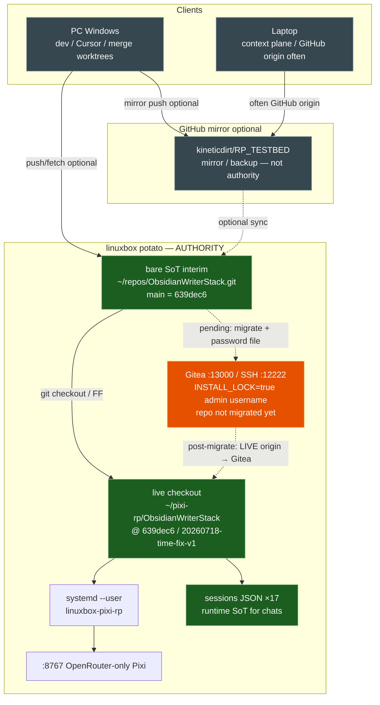
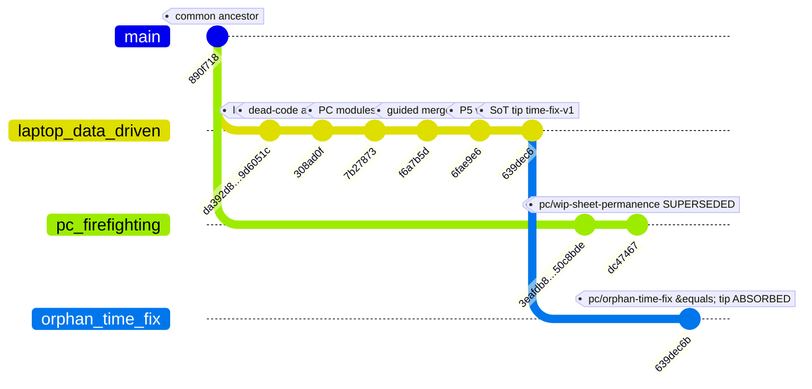
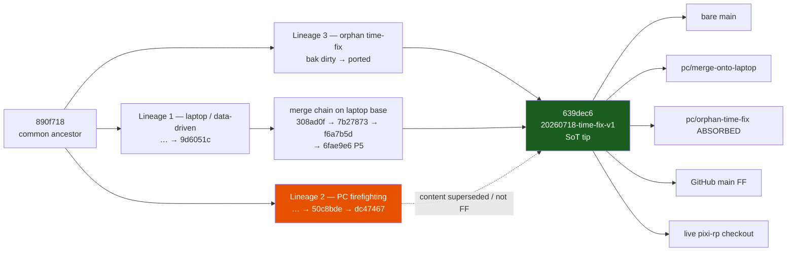
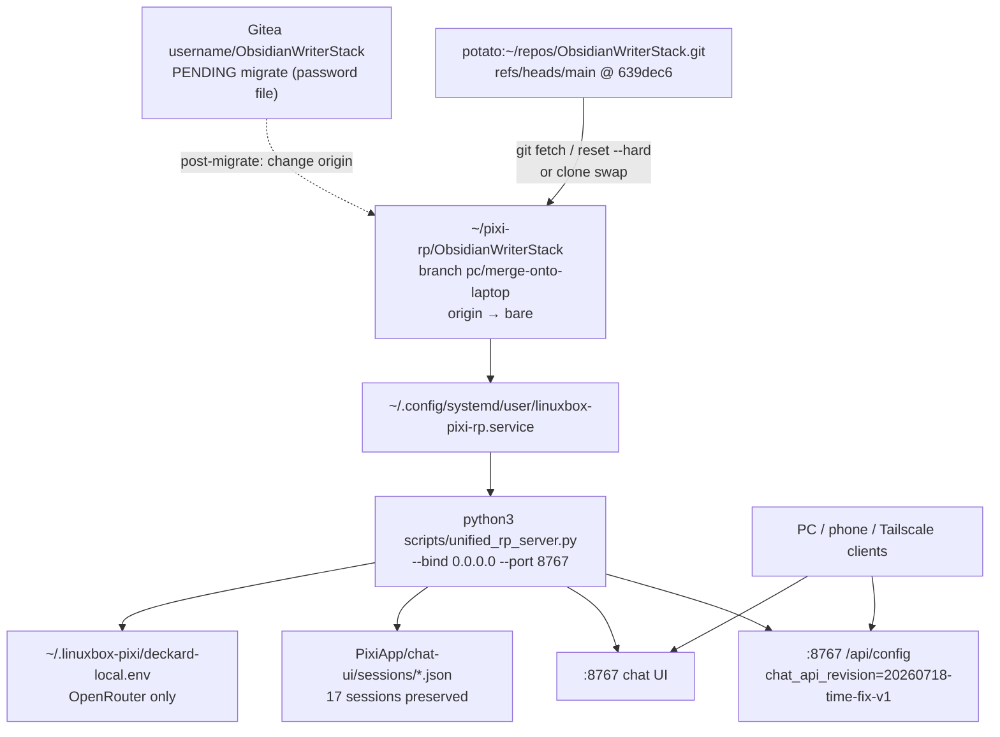
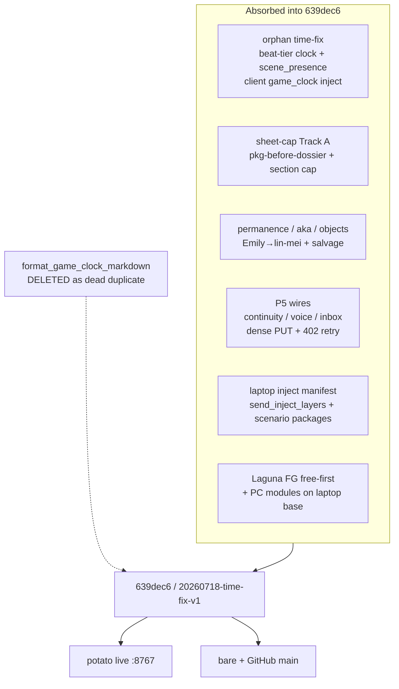

# RP SoT topology — 2026-07-18

**Verified live (SSH `potato` Tailscale, 2026-07-18T19:52Z):**

| Surface | Value |
|---------|--------|
| Live checkout tip | `639dec6e2c43d9216e21c00d9ff062846c997168` (`639dec6`) |
| Rev | `20260718-time-fix-v1` (`chat_api_revision`) |
| Checkout | `~/pixi-rp/ObsidianWriterStack` on `pc/merge-onto-laptop` |
| `origin` | bare `~/repos/ObsidianWriterStack.git` (interim canonical) |
| Bare `main` / `pc/merge-onto-laptop` / `pc/orphan-time-fix` | all `639dec6` |
| Service | `linuxbox-pixi-rp` active; `:8767/api/config` → 200 |
| Sessions | 17 under `PixiApp/chat-ui/sessions` |
| Gitea `:13000` | **wizard done** (`INSTALL_LOCK=true`, Sign In OK, admin `username`) — migrate waits on `~/.gitea-migrate.env` password |

**Authority:** linuxbox bare (until migrate to Gitea). PC / laptop / GitHub are mirrors or dirty worktrees.  
**What Gitea is for:** local canonical git host for RP/Pixi (LAN+Tailscale) so deploys are `git pull`, not SCP forever. Not public.

---

## A. High-level — machines / hosts / dirty vs SoT



**Legend**

| Role | What |
|------|------|
| **SoT** | bare `main` tip + live checkout at same SHA; session JSON is runtime SoT |
| **Mirror** | GitHub RP_TESTBED; PC/laptop clones |
| **Dirty** | PC local worktrees / bak trees (`*.bak.*`) — not authority |
| **Pending** | Gitea host ready; bare→Gitea migrate blocked on password file |

---

## B. Branch lineage — ancestor → lineages → tip `639dec6`



Readable flowchart (same facts; prefer if gitGraph rendering is picky):



**Absorbed / superseded (do not reckless-delete):**

| Ref | SHA | Status |
|-----|-----|--------|
| `pc/orphan-time-fix` | `639dec6` | Absorbed (= tip); safe to delete later after ack |
| `pc/dead-code-tooling` | `50c8bde` | Superseded by merge-chain ports |
| `pc/wip-sheet-permanence` | `dc47467` | Superseded divergent snapshot — keep as historical |

---

## C. Deploy / runtime



---

## D. Feature absorption → single tip



---

## Clone URLs (current + post-migrate)

**Current SoT (bare — works now):**

```text
# from potato
git clone ~/repos/ObsidianWriterStack.git

# from PC/LAN
git clone ssh://abhinav@192.168.4.59/home/abhinav/repos/ObsidianWriterStack.git
# or: potato:repos/ObsidianWriterStack.git

# Tailscale
git clone ssh://abhinav@100.122.108.94/home/abhinav/repos/ObsidianWriterStack.git
```

**Gitea (after migrate — owner `username`):**

```text
HTTP LAN:       http://192.168.4.59:13000/username/ObsidianWriterStack.git
HTTP Tailscale: http://100.122.108.94:13000/username/ObsidianWriterStack.git
SSH LAN:        ssh://git@192.168.4.59:12222/username/ObsidianWriterStack.git
SSH Tailscale:  ssh://git@100.122.108.94:12222/username/ObsidianWriterStack.git
```

Post-wizard helper: `scripts/linuxbox/gitea-migrate-rp-from-bare.sh` + `gitea-migrate.env.example`
