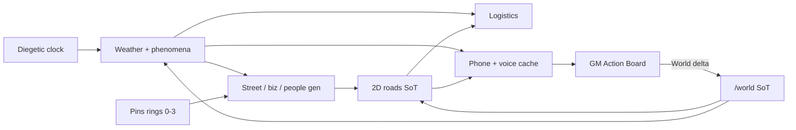

# Tableslop World — full plan + deliverables (2026-08-12)

**Status:** M0 COMPLETE — plan package locked. Next: M1 Paradise 2D slice (implementation).  
**Holder:** `tableslop-world-full-plan`  
**Lane agent:** `project-tableslop` (+ `role-ux` · `role-backend` · `role-frontend` · `role-cicd`)  
**Hard locks:** NEVER wipe `regions-ui.json`. **/3d SHELVED** — 2D map is working SoT; transfer later.

## Sibling deliverables (subagent package)

| Doc | Role | Path |
|-----|------|------|
| **This master** | orchestrator / project-tableslop | `docs/plans/tableslop-world-full-plan-2026-08-12.md` |
| UX flows L0→L2 | role-ux | `docs/plans/tableslop-world-ux-flows-2026-08-12.md` |
| SoT shards + APIs | role-backend | `docs/plans/tableslop-world-sot-apis-2026-08-12.md` |
| Frontend 2D + phone chrome | role-frontend | `docs/plans/tableslop-world-frontend-2d-2026-08-12.md` |
| Verify / issue finding | role-cicd | `docs/plans/tableslop-world-verify-issues-2026-08-12.md` |
| Living canvas | GM review | Cursor canvases `tableslop-world-story-plan.canvas.tsx` |
| Dev log SoT | product calendar | `projects/tableslop/dev-calendar.json` |
| Prior dual-app | context | `docs/plans/tableslop-dual-app-roadmap-2026-08-01.md` |

---

## 1. Intent / why

Isla Primavera needs a **congruent living world**: generators, weather, logistics, stories, and phone audio that **affect each other**, authored and verified on the **2D map** first. Players experience diegetic outcomes; GM/admin see threads and systems on `/world` + overlays. Height `/3d` work is paused until 2D roads/overlays lock.

---

## 2. Locks (GM)

| Lock | Decision |
|------|----------|
| World URL | Full page `/world` (new view, not HUD stub) |
| Action board | GM/admin only; thread viz; resolve → World delta (or explicit no-op) |
| Generators | streets ↔ history ↔ business ↔ people (bidirectional) |
| Pins | High foot-traffic / interest cores → radiate rings 0–3 |
| Weather | Diegetic datetime + phenomenon bag (TTL/decay); weather feeds next weather |
| Placement | ~100 mi N + 400 mi E of Hawaiʻi → ~23°N, 152°W (NE trades, NEC/gyre) |
| Overlays (2D) | Wind, water/current/swell, GMaps-style roads/highways, logistics, pins |
| Road SoT | **2D working version**; transfer to 3D later |
| /3d | **Shelved** |
| Stories | Objects + weighted branches; PvP / PvE / PvW; prose + internal logic |
| Goals | From asks (“carnival culture”) → ground → artifacts → threads |
| Phone | Diegetic 911/emergency + non-emergency split; PC voice gen (speech+moans, not robotic); potato = cache only |
| Dev log | Timeline / features / bugs + dial-matrix issue finding |

---

## 3. Architecture (coupling)

**Shard roots** (see SoT APIs doc): `campaigns/tropic-gooner/{roads,weather,board,phone,logistics}/` — NDJSON + index; hot weather summary stays small. **Never** put GB geometry in `regions-ui.json`.

---

## 4. Vertical slice v1 (Paradise core) — acceptance

**Scope:** `r01-paradise` ring 0 only.

| # | Criterion | Verify |
|---|-----------|--------|
| V1 | Overlay toggles: roads + wind stub + pins | Frontend + verify O-checklist |
| V2 | At least one highway + local class readable GMaps-style | Visual + roads shard load |
| V3 | Weather tick uses diegetic date; phenomenon can bias next tick | weather self-check |
| V4 | One board thread resolve writes a World delta (e.g. road closed / pin flag) | API + assert |
| V5 | Dial matrix: contact + dead + non-emergency pass; 911 tracked (xfail until feat) | phone smoke / node lookup |
| V6 | regions-ui vert counts unchanged | `tableslop-gm-borders-guard` |
| V7 | No /3d gate | N/A |

---

## 5. Deliverables backlog

| ID | Deliverable | Owner role | Depends | Verify |
|----|-------------|------------|---------|--------|
| D-ROADS | Roads index + r01 NDJSON; import/bridge `highways.json` | backend + frontend | — | region load curl + overlay |
| D-OVERLAY | Toggle UI wind/water/roads/logistics/pins | frontend + ux | D-ROADS | O1–O5 |
| D-WX | Phenomenon bag + datetime drivers in weather engine | backend | clock | determinism self-check |
| D-LOGI | Logistics overlay v1 (one corridor Paradise) | frontend + backend | D-ROADS, D-WX | overlay checklist |
| D-GEN | Congruent gen hooks (history/biz/people inputs) for local streets | project-tableslop | D-ROADS, pins | quality bar checklist |
| D-BOARD | GM Action Board L2 + resolve→delta | ux + backend + frontend | world auth | board assert |
| D-911 | Emergency lookup + triage session | backend + frontend | phone engine | dial matrix P-911 |
| D-VOICE | PC voice spike report + cache manifest contract | project-tableslop (PC) | — | A/B naturalness notes |
| D-AUDIO | Phone `<audio>` playback from manifest | frontend | D-VOICE | soft P-AUD |
| D-VERIFY | Smoke dial matrix + M1 gates G0–G7 | cicd | D-911 path | verify doc |
| D-DEVLOG | Keep `dev-calendar.json` ids in sync | GM + agents | ongoing | ids match bugs/feats |

---

## 6. Data schemas (sketch — normative detail in SoT APIs doc)

- **Road feature (NDJSON line):** `{id, region_id, class: hwy|arterial|local, coords[], name?, meta}`
- **Phenomenon:** `{id, kind, started_at, ttl_hours, decay, mods{rain,wind,swell}, region_scope[]}`
- **Board beat:** `{id, thread_id, when, where, actors[], class, branches[{id,p}], resolved?, world_delta?}`
- **Emergency directory:** `{code:"911", type:"emergency", script_id, voice_utterance_ids[]}`
- **Voice manifest:** `{utterance_id, path, sha256, character_id?, kind: speech|moan|sfx|ivr}`

---

## 7. Non-goals / shelved

- /3d heightmesh polish, meshMax tuning, 3D-only roads  
- Live NOAA scrape into play  
- TTS inference on potato  
- Carpet-gen fringe streets before core passes quality bar  
- Player-editable Action Board  
- Replacing GM `regions-ui` borders with generated polys  

---

## 8. Risks + clarifications (LOCKED defaults 2026-08-13)

| Topic | Locked default | Reopen only if GM overrides |
|------|----------------|------------------------------|
| Road SoT vs `highways.json` | **Import-as-ref** in `roads/meta/` — do not delete paint highways | Replace-all gen |
| Logistics v1 | **Freight / ferry / bus corridor only** (Paradise) | Full commerce apps in overlay |
| Weather tick | **Clock primary; board may force pulse** | Clock-only or board-only |
| Wind/water viz audience | **All players can view; GM/admin edit** | GM-only view |
| GMaps generator | **Visual classes + procedural local fill from pins** | Visual-only trace |
| Goal asks | **GM files goals; players suggest later via inbox** | Player-direct goal write |

**Risks (still live):** GB load without regional shards; PC↔potato dual SoT; full-island regen freezes (patch locally); skipping World delta on resolve; reopening /3d early.

---

## 9. Milestones

| M | Name | Exit |
|---|------|------|
| **M0** ✅ | Plan package (this) | Docs + canvas + dev-calendar + §8 defaults + commit |
| **M1** | Paradise 2D slice | V1–V7 above |
| **M2** | Weather phenomena + logistics corridor | WX feedback visible; one logistics route |
| **M3** | Board + World deltas live | GM resolves thread → map/state change |
| **M4** | Phone 911 + PC voice cache | Emergency ≠ dead; at least IVR/dispatch voice cached |

---

## 10. Issue finding (summary)

Full matrix in verify doc. Dev-calendar ids already seeded:

- Features: `feat-phone-911`, `feat-phone-voice-pc`, …  
- Bugs: `bug-phone-no-911`, `bug-phone-beep-only-audio`, `bug-issue-finding-gap`  
- Timeline: `tl-2d-working-sot`, `tl-phone-911-voice`  

Intake: routing → bugs; audio → beep bug; harness gap → issue-finding bug; agent friction → papercuts.

---

## 11. Next action for implementers

1. ~~GM skim master + UX flows~~ → **M0 done** (defaults §8 locked 2026-08-13).  
2. Start **M1** against SoT APIs + frontend 2D + verify G0–G7 — **not** /3d.  
3. Order inside M1: D-ROADS (r01) → D-OVERLAY toggles → D-VERIFY dial matrix (911 xfail) → D-WX stub phenomenon field.  
4. **D-VOICE** PC spike may run in parallel (no potato TTS).  
5. Board (D-BOARD) / 911 feat (D-911) = M3/M4 unless a thin stub unblocks phone smoke.

---

## 12. M0 checklist

- [x] Master plan  
- [x] UX / SoT / Frontend / Verify siblings  
- [x] Canvas pointer  
- [x] Dev-calendar ids (911, voice, 2D SoT, bugs)  
- [x] §8 defaults locked  
- [x] Local git commit of plan package  

*M0 closed 2026-08-13 — subagents role-ux/backend/frontend/cicd + master synthesize.*